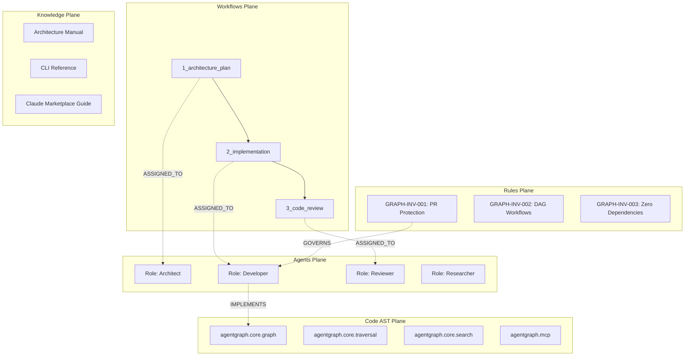

# AGENTS.md — AgentGraph Cognitive Substrate & Architecture Directives

> **Repository:** Bayly-AI/AgentGraph  
> **Framework:** AgentGraph Multi-Plane Engine  
> **Maintainer & Lead Reviewer:** Ray Bayly (@raybayly)  
> **Status:** Active / Open Source  

---

## 1. System Invariants & Inviolable Directives

### GRAPH-INV-001: Main & Development Branch Protection
This repository is open source and publicly accessible. However, direct pushes to `development`, `master`, `main`, `staging`, or `testing` are restricted exclusively to repository administrators. All proposed modifications must be submitted via Pull Requests against the `development` branch and must receive explicit review and approval by **Ray Bayly (`@raybayly`)** prior to merging.

### GRAPH-INV-002: Acyclic Workflow Execution
All multi-agent pipelines and step dependencies must form a strictly Directed Acyclic Graph (DAG). Topological cycle verification (`agentgraph validate`) must pass cleanly on all PRs.

### GRAPH-INV-003: Zero External Core Dependencies
Core Python engine functionality must not require external pip dependencies beyond the Python 3.9+ standard library.

---

## 2. Multi-Plane Graph Topology

---

## 3. Registered Agent Roles & Responsibilities

| Role ID | Role Name | Primary Objective | Default Tool Authorization |
| :--- | :--- | :--- | :--- |
| `architect` | System & Graph Architect | Designs multi-agent topologies and system boundaries | `view_file`, `agentgraph_query`, `agentgraph_traverse`, `agentgraph_export`, `agentgraph_validate` |
| `developer` | Autonomous Engineer | Implements features, resolves dependency graphs, and generates unit tests | `view_file`, `write_to_file`, `replace_file_content`, `run_command`, `agentgraph_query`, `agentgraph_traverse`, `agentgraph_resolve` |
| `reviewer` | Topology & Code Reviewer | Audits pull requests, verifies graph health, and reviews code | `view_file`, `agentgraph_query`, `agentgraph_validate`, `agentgraph_export` |
| `researcher` | Knowledge & Deep Research | Queries documentation, rules, and code entities | `view_file`, `search_web`, `agentgraph_query`, `agentgraph_traverse` |

---

## 4. Contributing & Pull Request Workflow

1. Fork the repository and create a feature branch (`feat/your-feature`).
2. Run local validation: `python -m agentgraph quality-gate`.
3. Submit a Pull Request targeting `development`.
4. Await review and approval from `@raybayly`.
