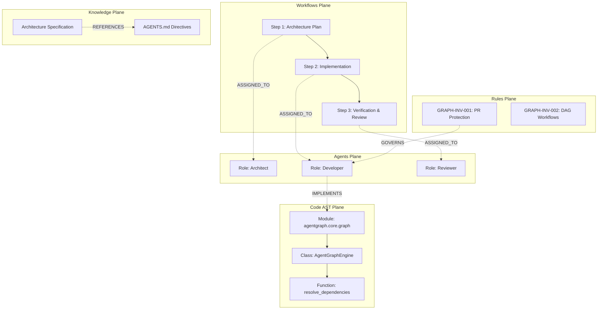

# AgentGraph: Multi-Plane Cognitive Substrate & Knowledge Graph Engine for AI Agents

[](https://www.npmjs.com/package/agentgraph-node-plugin)
[](LICENSE)
[](#)
[](docs/engineering/CLAUDE_MARKETPLACE.md)

> **Standalone, high-performance multi-plane graph substrate, BM25 search engine, topological DAG resolver, and AST dependency indexer for autonomous AI agents, multi-agent workflows, CLI, and Node.js applications.**

---

## 🚀 Quick Links & Downloads

- 📦 **NPM Node.js Plugin Package:** [`npm install agentgraph-node-plugin`](https://www.npmjs.com/package/agentgraph-node-plugin)
- 🤖 **Claude Desktop & Claude Code MCP Integration:** [CLAUDE_MARKETPLACE.md](docs/engineering/CLAUDE_MARKETPLACE.md)
- 🐍 **Standalone Python CLI:** [`./release/python/cli/agentgraph`](release/python/cli/)
- 📖 **Technical Architecture & Developer Guide:** [README.TECHNICAL.md](README.TECHNICAL.md)
- 🛡️ **Contributing & PR Policy:** [CONTRIBUTING.md](CONTRIBUTING.md)

---

## 💡 What is AgentGraph?

Autonomous AI agent systems require fast, deterministic, structured memory and relationship awareness across codebases, multi-agent roles, task execution pipelines, and system invariants.

**AgentGraph** separates agent cognition into a **5-Plane Heterogeneous Graph Substrate**:



### The 5 Graph Planes
1. **Agents Plane (`agents`):** Agent roles, tools, and parent role inheritance hierarchies.
2. **Workflows Plane (`workflows`):** Multi-agent execution DAGs, step sequences, and role assignments.
3. **Knowledge Plane (`knowledge`):** Markdown specifications, architecture docs, and cross-references.
4. **Code AST Plane (`code`):** Python and JS/TS modules, classes, methods, functions, and import references.
5. **Rules Plane (`rules`):** Repository invariants, policies, and guidelines.

---

## ⚡ Core Capabilities

- **Zero External Dependencies:** Built with pure standard libraries (SQLite3, AST, JSON, BM25 math) for zero runtime baggage.
- **Sub-Millisecond BM25 Lexical Ranking:** Instant keyword and semantic entity search across all graph nodes.
- **Topological DAG Dependency Resolution:** Resolves upstream/downstream prerequisites in execution order.
- **Cycle & Dangling Edge Validation:** Audits graph health and guarantees acyclic pipelines.
- **Visual Diagram Exporters:** Real-time generation of Mermaid flowcharts and Graphviz DOT representations.
- **Model Context Protocol (MCP) Server:** Native stdio JSON-RPC 2.0 server for instant plug-and-play with Anthropic Claude Desktop, Claude Code, Cursor, and Windsurf.

---

## 💻 Installation & Quickstart

### 1. Python CLI & SDK

```bash
# Clone the repository
git clone https://github.com/Bayly-AI/AgentGraph.git
cd AgentGraph

# Run standalone executable or install editable
./release/python/cli/agentgraph --help
pip install -e .
```

### 2. Initialize a Workspace

```bash
agentgraph init --dir .
```
This scaffolds `.agentgraph/` (`config.json`, `agents/`, `workflows/`, `rules/`, `knowledge/`), `AGENTS.md`, and a git pre-commit hook.

### 3. Sync & Query Graph

```bash
# Ingest workspace code AST and documentation into graph database
agentgraph sync

# BM25 Search
agentgraph query "developer"

# Graph Traversal
agentgraph traverse "role:developer" --depth 2

# Dependency Resolution
agentgraph resolve "workflow:feature_delivery_pipeline"

# Export Mermaid Diagram
agentgraph export --format mermaid
```

---

## 📦 Node.js Plugin SDK

Install in any Node.js / TypeScript project:

```bash
npm install agentgraph-node-plugin
```

```typescript
import { AgentGraphClient } from "agentgraph-node-plugin";

const graph = new AgentGraphClient();
await graph.sync();

// Search nodes
const results = await graph.query("architecture", "knowledge");

// Resolve dependencies
const executionOrder = await graph.resolveDependencies("workflow:feature_delivery_pipeline");

// Validate topology
const health = await graph.validate();
console.log("Graph Valid:", health.is_valid);
```

---

## 🤖 Claude Desktop & Claude Code MCP Integration

Add AgentGraph to your `claude_desktop_config.json`:

```json
{
  "mcpServers": {
    "agentgraph": {
      "command": "agentgraph",
      "args": ["mcp", "--dir", "/path/to/your/workspace"]
    }
  }
}
```

Claude Desktop and Claude Code CLI gain instant access to 7 governed graph tools:
- `agentgraph_query`
- `agentgraph_traverse`
- `agentgraph_resolve`
- `agentgraph_validate`
- `agentgraph_export`
- `agentgraph_sync`
- `agentgraph_stats`

---

## 🔒 Open Source Governance & Contribution Policy

AgentGraph is an open source project under GPLv3.

- **Public Cloning & Access:** Anyone can clone, inspect, and fork the repository.
- **Branch Protection:** Direct pushes to `development`, `master`, `main`, `staging`, and `testing` are restricted exclusively to repository administrators.
- **Pull Request Required:** All changes must be submitted via Pull Requests targeting the `development` branch.
- **Mandatory PR Approval:** Merging requires automated Quality Gate clearance and explicit review/approval by **Ray Bayly (`@raybayly`)** or designated repository administrators.

See [CONTRIBUTING.md](CONTRIBUTING.md) and [.github/CODEOWNERS](.github/CODEOWNERS) for details.

---

## 📄 License

GNU General Public License v3.0 (GPLv3) — see [LICENSE](LICENSE) for details.
